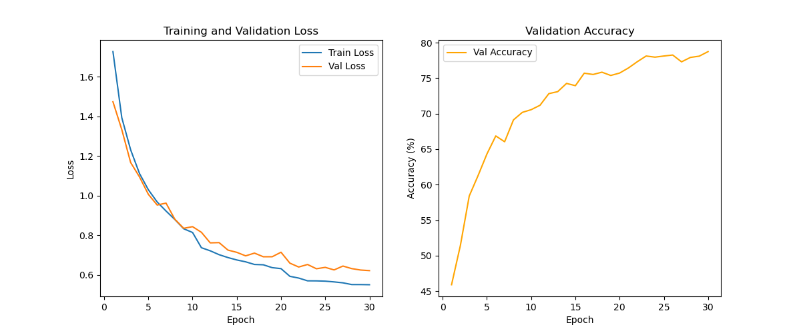
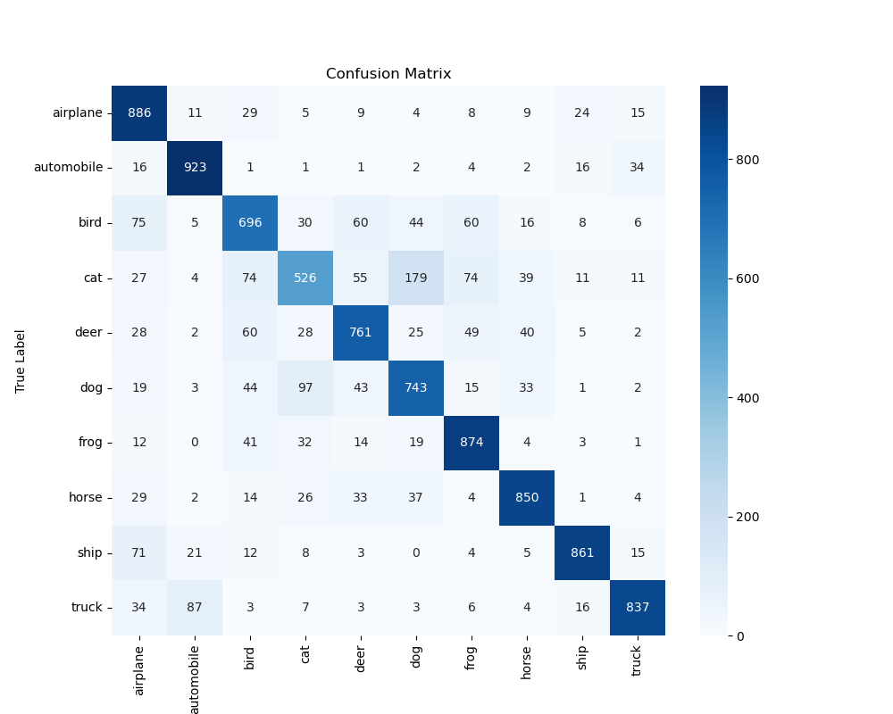
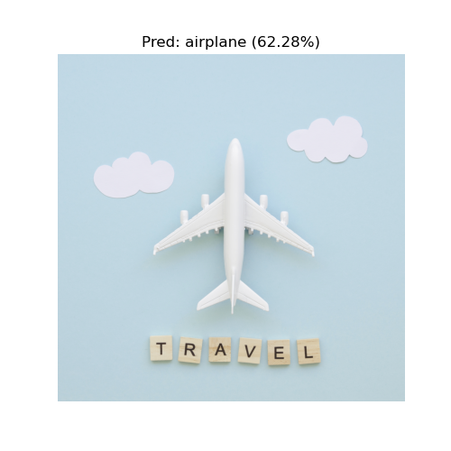

# 深度学习算法实践实验报告
**——基于卷积神经网络 (CNN) 的 CIFAR-10 图像分类**

| 项目 | 内容 |
| :--- | :--- |
| **课程名称** | 深度学习与神经网络 |
| **实验人员** | ReragoAliNa |
| **学号** | [待填] |
| **实验日期** | 2025年12月15日 |
| **指导教师** | [待填] |

---

## 一、 实验目的

1.  **掌握核心原理**：深入理解卷积神经网络（CNN）中卷积层（特征提取）、池化层（降维）、激活函数（非线性映射）及全连接层的工作机制。
2.  **全流程实践**：熟悉使用 PyTorch 框架进行深度学习开发的完整流程，包括数据预处理、模型构建、训练循环、评估测试及模型持久化。
3.  **优化与调优**：掌握数据增强（Data Augmentation）、正则化（Dropout）及学习率调度（Scheduler）等提升模型泛化能力的方法。
4.  **工程问题解决**：培养解决实际开发中遇到的环境配置（如 GPU 加速）及系统兼容性（如 Windows 多进程加载数据报错）问题的能力。

---

## 二、 实验原理

### 1. CNN 核心思想
卷积神经网络通过模拟人类视觉系统，利用**局部连接**和**权值共享**的方式从图像中提取特征。
*   **卷积层**：使用卷积核在图像上滑动，提取边缘、纹理等局部特征。
*   **池化层**：对特征图进行下采样，减少参数量并提高特征的平移不变性。
*   **全连接层**：将提取的高维特征展平，映射到样本标记空间，输出分类概率。

### 2. 数据集
本实验使用 **CIFAR-10** 数据集，包含 60,000 张 32×32 像素的 RGB 彩色图像，共 10 个类别（飞机、汽车、鸟、猫、鹿、狗、青蛙、马、船、卡车）。

### 3. 模型结构设计
构建了一个 4 层卷积 + 2 层全连接的轻量级网络。

| 层级 | 类型 | 输入尺寸 | 输出尺寸 | 关键参数 |
| :--- | :--- | :--- | :--- | :--- |
| Layer 1 | Conv2d + ReLU + MaxPool | 32×32×3 | 16×16×16 | Kernel=3, Stride=1 |
| Layer 2 | Conv2d + ReLU + MaxPool | 16×16×16 | 8×8×32 | Kernel=3, Stride=1 |
| Layer 3 | Conv2d + ReLU + MaxPool | 8×8×32 | 4×4×64 | Kernel=3, Stride=1 |
| Layer 4 | Conv2d + ReLU + MaxPool | 4×4×64 | 2×2×128 | Kernel=3, Stride=1 |
| FC 1 | Linear + ReLU + Dropout | 512 | 512 | Dropout=0.5 |
| FC 2 | Linear | 512 | 10 | 输出分类 |

---

## 三、 实验步骤与关键代码

### 1. 数据预处理与增强
为了防止过拟合，对训练集进行了随机裁剪和翻转增强。

```python
# 关键代码：数据变换
train_transform = transforms.Compose([
    transforms.RandomCrop(32, padding=4),       # 随机裁剪，增加位置扰动
    transforms.RandomHorizontalFlip(),          # 随机水平翻转，增加方向扰动
    transforms.ToTensor(),
    transforms.Normalize((0.5, 0.5, 0.5), (0.5, 0.5, 0.5)) # 归一化至 [-1, 1]
])

# Windows 下必须使用 if __name__ == '__main__' 保护，否则多进程报错
if __name__ == '__main__':
    train_loader = DataLoader(dataset, batch_size=64, shuffle=True, num_workers=2)
```

### 2. 模型构建
继承 `nn.Module` 类，定义网络结构。

```python
class CIFAR10_CNN(nn.Module):
    def __init__(self):
        super(CIFAR10_CNN, self).__init__()
        # 定义卷积层：输入3通道 -> 输出16通道
        self.conv1 = nn.Conv2d(3, 16, 3, padding=1)
        self.pool = nn.MaxPool2d(2, 2)
        # ... (中间层省略) ...
        self.fc1 = nn.Linear(128 * 2 * 2, 512)
        self.dropout = nn.Dropout(0.5) # 正则化，随机丢弃神经元
        self.fc2 = nn.Linear(512, 10)

    def forward(self, x):
        x = self.pool(F.relu(self.conv1(x))) # 卷积 -> 激活 -> 池化
        # ...
        x = x.view(-1, 128 * 2 * 2)          # 展平
        x = self.dropout(F.relu(self.fc1(x)))
        return self.fc2(x)
```

### 3. 训练循环
使用交叉熵损失和 Adam 优化器进行模型更新。

```python
# 定义损失函数与优化器
criterion = nn.CrossEntropyLoss()
optimizer = optim.Adam(model.parameters(), lr=0.001)

# 训练迭代
for epoch in range(num_epochs):
    model.train() # 开启训练模式（启用 Dropout）
    for images, labels in train_loader:
        images, labels = images.to(device), labels.to(device) # 移至 GPU
        
        optimizer.zero_grad()       # 梯度清零
        outputs = model(images)     # 前向传播
        loss = criterion(outputs, labels) # 计算损失
        loss.backward()             # 反向传播
        optimizer.step()            # 更新参数
```

---

## 四、 实验结果与分析

### 1. 训练过程分析
模型共训练了 30 个 Epoch，训练曲线如下所示：


*图1：训练损失与验证准确率曲线*

*   **收敛性**：训练损失（Loss）随迭代次数平稳下降，验证损失紧随其后，未出现明显的反升现象。
*   **准确率**：验证准确率呈阶梯状上升（得益于 StepLR 学习率衰减），最终稳定在 **79.57%** 左右。这表明模型成功学习到了图像特征，且数据增强策略有效抑制了过拟合。

### 2. 测试集评估
在独立的测试集（10,000张）上进行评估：
*   **总体准确率**： **79.57%**

### 3. 混淆矩阵分析
通过混淆矩阵分析各类别的误判情况：


*图2：测试集混淆矩阵*

*   **分析**：模型在区分 **Cat（猫）** 和 **Dog（狗）** 时错误率较高，两者容易互相混淆。原因可能是它们具有相似的身体结构和背景纹理。而 **Ship（船）** 和 **Truck（卡车）** 等类别识别率较高，因为其特征（背景为海面/道路，刚性边缘）较为独特。

### 4. 单样本推理应用
输入一张外部图像，模型的预测结果如下：


*图3：单张图像预测结果与置信度*

*   **结论**：模型不仅在统计指标上表现良好，在实际单样本推理中也表现出高置信度的正确分类能力。

---

## 五、 问题与解决方案

在实验过程中，遇到了以下典型问题并成功解决：

### 1. Windows 下多进程报错 (RuntimeError)
*   **问题描述**：设置 `DataLoader` 的 `num_workers=2` 时，程序抛出 `RuntimeError: An attempt has been made to start a new process...`。
*   **原因分析**：Windows 系统使用 `spawn` 方式启动子进程，子进程会重新导入主模块。如果执行代码暴露在全局作用域，会导致递归创建进程。
*   **解决方案**：规范代码结构，将训练和评估的主逻辑封装在 `def main():` 中，并使用 `if __name__ == '__main__':` 保护入口。

### 2. 模型训练速度过慢 (Device: CPU)
*   **问题描述**：初始运行时提示 `Using device: cpu`，训练一个 Epoch 耗时极长。
*   **原因分析**：原 Python 环境安装的是 CPU 版本的 PyTorch，无法调用 NVIDIA 显卡。
*   **解决方案**：卸载旧版本，根据本机环境 (NVIDIA GeForce RTX 3060) 重新安装 GPU 版 PyTorch。训练速度提升显著。

---

## 六、 实验总结

本次实验成功构建了一个端到端的图像分类模型。虽然使用的网络结构较为简单（4层 CNN），但在 CIFAR-10 上仍取得了近 80% 的准确率。通过解决环境配置与代码规范问题，加深了对深度学习工程实践的理解。未来可尝试引入 **ResNet** 残差网络或迁移学习技术，以进一步提升分类精度。
